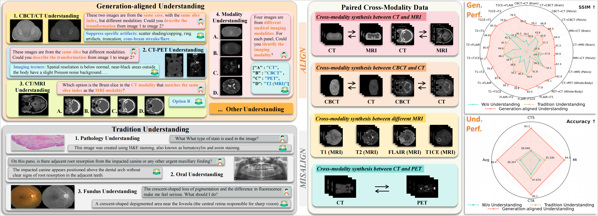
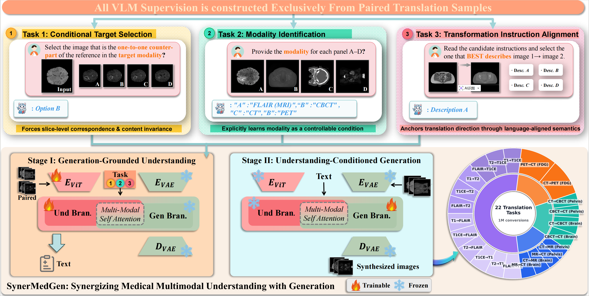
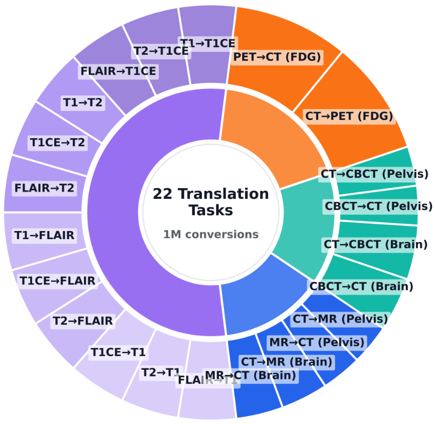
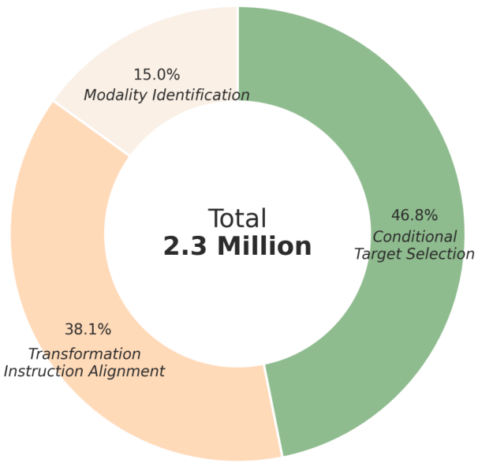
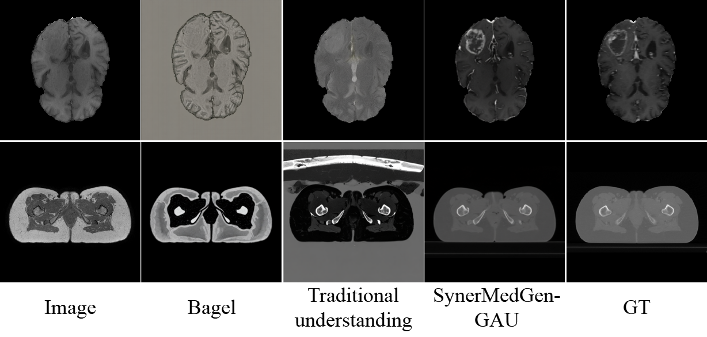
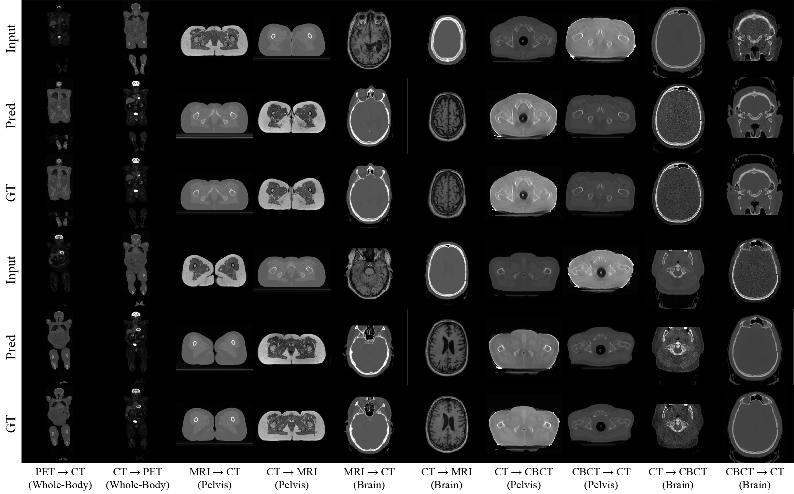
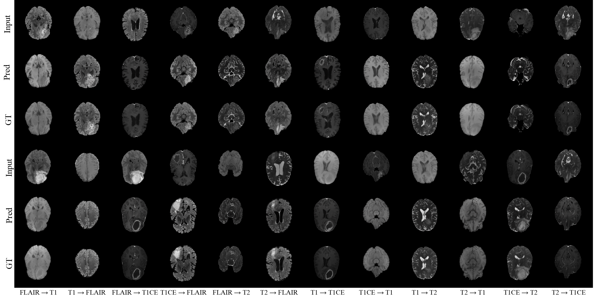
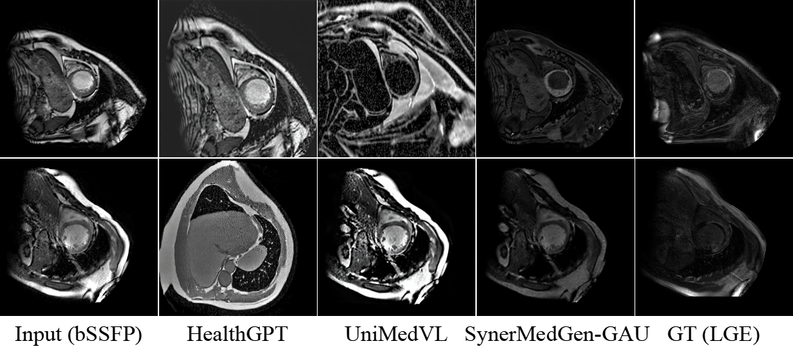
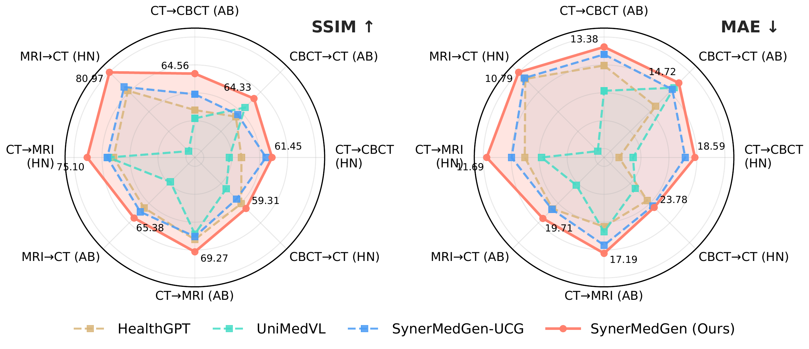

# SynerMedGen

### Synergizing Medical Multimodal Understanding with Generation via Task Alignment

**Accepted to ICML 2026**

Weiren Zhao, Yi Dong, Cheng Chen  
The University of Hong Kong

  

## News

- **2026-05-11:** SynerMedGen is accepted to **ICML 2026**.
- **2026-05-11:** Project materials and visualizations are prepared for release.
- Code, checkpoints, and dataset access instructions will be released in stages.

## Overview

SynerMedGen studies a central question in unified medical multimodal modeling:

> What form of understanding truly benefits generation?

Existing unified medical models often train understanding and generation with weakly related objectives. A model can become better at recognition-style medical VQA while still failing to preserve the slice-level correspondence, anatomy, pathology, and modality-specific constraints needed for medical image synthesis.

SynerMedGen addresses this gap with **generation-aligned understanding**: instead of using generic medical understanding supervision, we derive understanding tasks directly from paired generation data. The learned representations are then transferred into the generation branch through a two-stage training strategy.

## Highlights

- **Generation-aligned understanding:** We align understanding objectives with generation requirements by deriving supervision from paired medical synthesis data.
- **Three task-aligned VLM tasks:** Conditional Target Selection, Modality Identification, and Transformation Instruction Alignment learn correspondence, modality control, and transformation direction.
- **Two-stage training:** Stage I learns generation-beneficial representations; Stage II performs latent-space conditional generation.
- **Broad evaluation:** SynerMedGen is evaluated across **22 medical image synthesis tasks**, including CT, MRI, PET, and CBCT synthesis routes.
- **SynerMed dataset:** We introduce a large-scale dataset with **1M paired synthesis samples** and **2M generation-aligned understanding instances**.

## Method

  

SynerMedGen builds on a unified multimodal understanding and generation framework. The key contribution is not a task-specific generator, but a general principle for training the understanding pathway so that it becomes useful for generation.

### Generation-Aligned Understanding

We construct three understanding tasks from paired medical synthesis samples:

| Task | Goal | Generation benefit |
| --- | --- | --- |
| **Conditional Target Selection (CTS)** | Select the correct paired target slice under a target-modality request. | Learns one-to-one anatomical correspondence. |
| **Modality Identification (MI)** | Identify medical imaging modalities. | Makes modality an explicit controllable factor. |
| **Transformation Instruction Alignment (TIA)** | Align paired visual changes with textual transformation instructions. | Grounds what should change and what should remain invariant. |

### Two-Stage Training

| Stage | Name | Description |
| --- | --- | --- |
| **Stage I** | Generation-Aligned Understanding (GAU) | Trains the understanding pathway on CTS, MI, and TIA to learn synthesis-sufficient representations. |
| **Stage II** | Unified Conditional Generation (UCG) | Optimizes conditional medical image synthesis in VAE latent space while transferring the Stage I representation. |

## SynerMed Dataset

SynerMed is a unified paired dataset for medical image synthesis and generation-aligned understanding. It integrates multiple public medical synthesis resources, including BraTS, SynthRAD2023, and AutoPET.

| Component | Scale |
| --- | ---: |
| Paired synthesis samples | 1M |
| Generation-aligned understanding instances | 2M |
| Synthesis directions | 22 |
| Modalities | CT, MRI, PET, CBCT |
| Main anatomical regions | Brain, pelvis, abdomen, whole body |

  
  

## Results

### Average SSIM on Medical Image Synthesis

Higher is better. Results are averaged over the synthesis routes reported in the paper.

| Method | SynthRAD2023 + AutoPET, 10 routes | BraTS, 12 routes |
| --- | ---: | ---: |
| ResViT | 79.77 | 84.92 |
| SynDiff | 80.35 | 86.16 |
| RCD | 81.08 | 86.15 |
| HealthGPT | 63.69 | 66.05 |
| UniMedVL | 54.56 | 76.65 |
| **SynerMedGen** | **83.28** | **89.03** |

SynerMedGen consistently outperforms both specialized medical image synthesis models and recent unified medical multimodal models across the evaluated synthesis routes.

### Why Task Alignment Matters

Using generation-aligned understanding supervision substantially improves synthesis quality compared with traditional medical understanding supervision. Even after Stage I only, SynerMedGen already achieves strong zero-shot synthesis performance, showing that the understanding branch has learned representations that directly benefit generation.

  

### Qualitative Results

  

  

### Generalization to Unseen Datasets

SynerMedGen also demonstrates robust generalization on unseen datasets such as MyoPS and SynthRAD2025.

  

  

